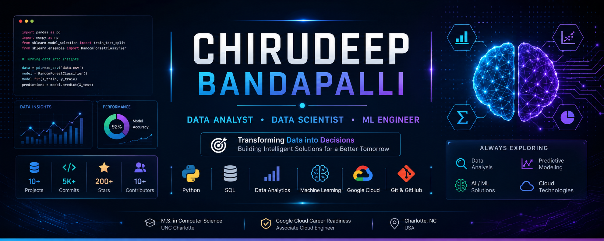

<div align="center">



<br><br>


<br>

<a href="https://www.linkedin.com/in/chirudeepbandapalli/">

</a>

<a href="https://chirudeep-portfolio.vercel.app/">

</a>


</div>

---

# 🎯 Professional Snapshot

```yaml
Name: Chirudeep Bandapalli

Education:
  Degree: M.S. Computer Science
  University: UNC Charlotte
  Graduation: May 2026

Target Roles:
  - Data Analyst
  - Data Scientist
  - Machine Learning Engineer

Core Skills:
  - Python
  - SQL
  - Machine Learning
  - Data Analytics
  - Data Visualization
  - Cloud Computing

Certification:
  - Google Cloud Career Readiness Associate Cloud Engineer
```

---

# ⚡ Tech Arsenal

<div align="center">

### Programming


### Data Science


### Cloud & Development


</div>

---

# 🚀 Featured Projects

<table>

<tr>

<td width="50%">

<h3>🍽 Restaurant Rating Analysis</h3>

Data-driven restaurant analytics platform focused on customer behavior, ratings, and business insights.

<b>Tech:</b>

Python • SQL • Analytics

</td>

<td width="50%">

<h3>🚗 Mobility Analysis</h3>

Exploratory mobility analysis uncovering transportation and movement trends through data.

<b>Tech:</b>

Python • Analytics • Machine Learning

</td>

</tr>

<tr>

<td width="50%">

<h3>😴 SleeSync</h3>

Sleep intelligence platform generating personalized recommendations through behavioral analytics.

<b>Tech:</b>

Machine Learning • Python

</td>

<td width="50%">

<h3>🫁 Lung Cancer Detection</h3>

ELM-based machine learning pipeline for early-stage lung cancer prediction.

<b>Tech:</b>

Python • Classification • ML

</td>

</tr>

</table>

---

# 📊 GitHub Analytics

<div align="center">


</div>

---

# 📈 Contribution Activity

<div align="center">


</div>

---

# 📊 Profile Summary

<div align="center">


</div>

---

# 🐍 Contribution Snake

<p align="center">

</p>

---

# 📜 Certifications

🏅 Google Cloud Career Readiness Associate Cloud Engineer

🏅 Python for Data Science (NPTEL)

---

# 🌐 Connect With Me

<div align="center">

<a href="https://chirudeep-portfolio.vercel.app/">

</a>

<a href="https://www.linkedin.com/in/chirudeepbandapalli/">

</a>

</div>

---

<div align="center">

### ⭐ Building Intelligent Solutions Through Data Analytics & Machine Learning

